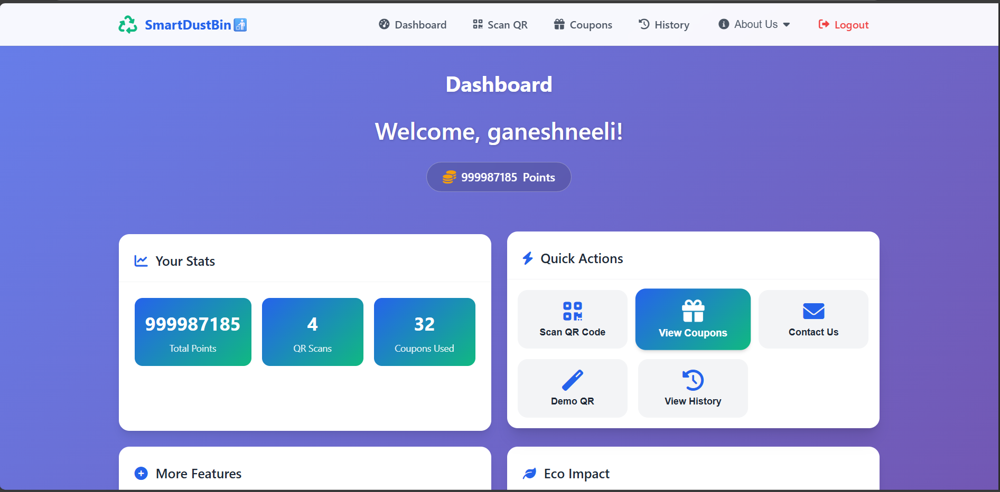
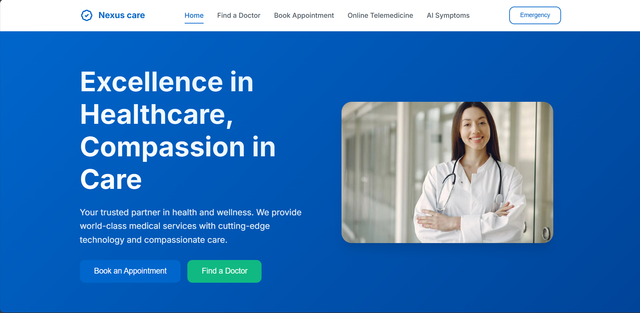

# Hi 👋, I'm Ganesh Neeli

### MERN Full Stack Developer | Java Full Stack Developer | AI Enthusiast

🎓 B.Tech CSE (AI) Student at Pragati Engineering College

🚀 Passionate about Web Development, Artificial Intelligence, IoT, and Problem Solving.

---

## 🌐 Connect With Me

- Portfolio: https://ganeshneeli.online
- Email: neelig552@gmail.com
- LinkedIn: https://linkedin.com/in/ganesh-neeli-07863732a
- GitHub: https://github.com/24a31a43i3
- HackerRank: https://hackerrank.com/24A31A43I3
- LeetCode: https://leetcode.com/u/24A31A43I3

---

## 🚀 About Me

- 🎓 B.Tech CSE (AI) | 2024-2028
- 📍 Pithapuram, Kakinada, India
- 💡 Interested in AI, Full Stack Development, IoT & Cloud
- 🌱 Currently Learning Advanced MERN Stack & System Design
- ⚡ Building Real World Projects

---

## 🛠 Tech Stack

### Languages

Java • JavaScript • Python • C • C++ • SQL

### Frontend

React.js • Next.js • HTML • CSS • Tailwind CSS • Bootstrap

### Backend

Node.js • Express.js

### Database

MongoDB • MySQL

### Tools

Git • GitHub • Docker • Postman • VS Code

### AI & ML

Machine Learning • OpenAI API • Gemini API

---

## 🚀 Featured Projects

### ♻ Smart Dustbin Reward System

An IoT-based smart dustbin using Arduino Nano and sensors.

#### Features

- Automatic lid opening
- Waste detection
- OLED QR Code generation
- User reward points system
- Website integration

**Tech Stack**

Arduino Nano • JavaScript • MongoDB • Node.js

---

### 🏥 Nexus Care

Healthcare Management Platform.

#### Features

- Appointment Scheduling
- Authentication
- Dashboard
- Responsive UI

**Tech Stack**

React.js • Tailwind CSS • Node.js • MongoDB

---

### 📁 VegaShare File Sharing Platform

Secure file upload and sharing application.

#### Features

- Upload Files
- Download Files
- Share Files
- Responsive Design

**Tech Stack**

React.js • Node.js • MongoDB

---

### 🌐 Portfolio Website

Modern Personal Portfolio.

#### Features

- Responsive Design
- Dark Mode
- Animations
- SEO Optimization

**Tech Stack**

React.js • Tailwind CSS • Framer Motion

---

## 🏆 Achievements

🥇 1st Place - Project Presentation Competition

🏅 AWS Academy Machine Learning Foundations Internship

🏅 Google Cloud Computing Foundations Certification

🏅 Java Full Stack Development Internship

---

## 📊 GitHub Stats

---

## 📈 Contribution Streak

---
## 🌐 Connect With Me

- Portfolio: https://ganeshneeli.online
- Email: neelig552@gmail.com
- LinkedIn: https://linkedin.com/in/ganesh-neeli-07863732a

## 💡 Quote
> "कर्मण्येवाधिकारस्ते मा फलेषु कदाचन — Focus on the code you create, not the recognition it receives. Build with dedication, learn continuously, and let success follow naturally." 💻🦚🚀
